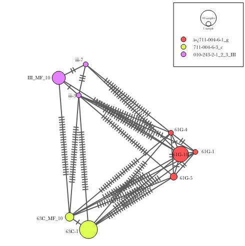

```{r setup, include=FALSE}
knitr::opts_chunk$set(echo = TRUE)
library(pegas)
library(knitr)
library(igraph)
library(RColorBrewer)
library(tidyverse)
library(cowplot)
library(tinytex)
```

```{r, include = FALSE}
################
#load all our shit
setwd(dirname(rstudioapi::getActiveDocumentContext()$path))
#mitochondrial genome fasta of all samples
fasta <- c('data/unamplified_amplified_mf.fas')
#ibsrelate output
genotype_dist = 'data/ibs.model0.results.ibspair'
#source file with ibs functions
source("scripts/ibsfunctions.R")
#source file that generates metadata
source("scripts/metadata.R")
###
source("scripts/ibslib.R")
```

In this report, I present the initial results of a Bill and Melinda Gates Foundation funded project, in partnership with the Drugs for Neglected Diseases Initiative. The overarching aim of the project is to develop a method for identifying whether patients infected with *Onchocerca volvulus*, post-treatment, are infected with worms that survived the treatment initially, or are worms that infected the patient following drug clearance.

Skin-snip biopsies for microfilaria (*mf*) can be used as a proxy for adult sampling - as adults are embedded in tough nodules. As mf are morphologcially indistinguishable from one another, we need to use genetics to identify whether mf from pre- and post- treatment samples are siblings with respect to one another.

The identification of siblings is critical because if the adult female worms (living in their nodules) have survived treatment, then we expect pre- and post- treatment *mf* to be related as full (same mother and father) or half (same mother *or* father) siblings. If the adult female worms have not survived treatment, we do not expect to identify siblings in pre- and post-  treatment mf samples.

Another way of approaching this would be to measure genetic diversity between pre- and post- treatment samples. If genetic diversity is the not significantly different between Pre- and Post- Tx samples, then we expect that treatment has failed, as the genetic composition of the worms infecting a host will probably not have changed (barring further infection). Similarly, if we observe significant differences in genetic diversity between pre- and post- treatment samples, then we expect that treatment has succeeded, and new adult females have taken up residence. One could test this with an Analysis of MOlecular VAriance (AMOVA) - or a binomial test, perhaps, or simply use identified full-siblings as a minimum estimate of treatment failure.

I think there are caveats to this approach. If one observes difference in genetic variation between treatment regimes, perhaps the sample has contained some mf from new infections, on top of an existing infection that was not cleared by an ineffective treatment. Or, whether the initial sampling did not capture *mf* that were siblings of those sampled in the post-treatment sample, but females were present in any case. Therefore this approach gives you the *minimum* estimate of treatment failure (inasmuch as where you observe siblings in pre- and post- treatment *mf* samples), but conveys none of the underlying uncertainty inherent in sampling skin-snip *mf*. This is important in this case, where published literature on the relative contribution of females to the sampled *mf* spatially and reproductively, is scant.

Inferring the number of adults that have contributed to the microfilaria pool, and then using the number of unique adult genotypes, to infer the likely number of adults that infect a host. This can then be used to calculate the certainty with which one predicts treatment success or failure.

 **Neves *et al*, 2018** [1]. (**open access**) published a statistical approach for estimating individual-level worm burdens using genetic data on helminth offspring. The method takes unique adult genotypes, inferred from a pool of sampled offspring, to infer the number of sampled offspring required to identify a given number of adults, and the 95% confidence interval for each offspring sample size. In this study, the authors used a sample set generated by **Gower, 2013**, who used microsatellite genotyping and sibship reconstruction in COLONY **Wang and Jones, 2010** to infer the number of adults contributing to offspring pools from **XX** patients.


In other studies, investigators have used a similar approach to infer *Nb* - the number of breeders, using methods for anlaysing genotype data in COLONY **Wang and Jones, 2010**

Pedigree-based methods 

*Difficulty in determining half-sibling relationships
*Microsat panels
*Speed on a desktop machine


```{r buildmetadata,include = FALSE}
metadata <-getseqandsamp()
```

I calculate the IBS statistics from the genotype distribution, calculated by IBSRelate for all pairs of the samples.
The output of interest are the statistics R1, R0 and KING-Robust Kinship. The statistics are described in more detail by **Waples *et al*, 2018** [2]. (**open access**). 

```{r doderived}
ibsrelateoutput <-  do_derived_stats(read_ibspair_model0(genotype_dist))
```

Then, I add some more data to the ibsrelate output, per pair of samples:

1. Whether both samples are from the same brood or not
2. The metadata for each samples on either side of the comparison
3. Whether a comparison is between mf - mf or mf - adult
4. The fraction of the total GLs in the callset used to calculate the IBS statistics


```{r relwrangle}
rel <- relmatrixwrangle(ibsrelateoutput, metadata)
rel %>% select(sample_id.x, sample_id.y, R0, R1, Kin, typecomp, fracsites, degree_bro) %>% head() %>% kable()
```

**Table 1: A subset of the pariwise relatedness data showing sample ids, IBS coefficients, type of comparison, fraction of sites involved in calculation, and the known degree of relationship - whether a sample is taken from the same brood or not**

Now, I plot the R0/R1 and R1-Kin from the relatedness data. In [1], the pattern of clustering in these plots clearly delineates the relationship between individuals. I filtered out comparisons that were missing >20% of the total GL callset.

```{r plotr0r1, fig.height = 3, fig.width = 8, fig.align = "center", echo = FALSE}
r1r0 <- plotr1r0(rel)
r1king <- plotr1king(rel)
rel <- definetherelationship(rel)
inferredrel <- plotinferredrel(rel)

# extract the legend from one of the plots
legend <- get_legend(
  # create some space to the left of the legend
  r1r0 + 
  theme(legend.position = "right") +
  theme(legend.justification = c(0,0.5))
)

prow <- plot_grid(
  r1r0 + theme(legend.position="none"),
  r1king + theme(legend.position="none"),
  labels = c("A", "B"),
  hjust = -1,
  nrow = 1
)

plot_grid(prow, legend, ncol = 2, rel_widths = c(2, 0.6))
```

**Figure 2: Plots of R0/R1 (A) and R0/King-Robust Kinship (B) coefficients for pairs of intrauterine microfilaria. Point colour (Known Degree) indicates whether microfilaria of a pair are from the same brood or not.**


In these two plots one can see clearly defined groupings - lower R0 and higher Kin groups are are full-sibs (reflected also by [1] Figure 3.) The cluster containing some within-brood pairs between R0 ~ 0.8 and 0.2 looks to me to be half-sib, roughly consistent with [1] also - although apparently deviations from this can depend on population. I have calculated *F* for all the individuals in this sample group (can provide if needed) and they are all highly outbred, so I don't expect inbreeding to be an issue. So, I use the R0, R1 and Kin values to derive a relationship for each pair - full-sibling (FS) or half-sibling (HS)

```{r plotinferredrel}
plotinferredrel(rel)

```

**Figure 3: Plot of R0/R1-Robust-kinship coefficients for pairs of intrauterine microfilaria. Point colour indicates the inferred relationship**

Now, I can plot these relationships using the iGraph library so we can get a better estimate of whether the relationship assignment has worked. We should see three groups of full or half siblings that cluster by brood. One of the broods is taken from an patient in a different village, so I'm not expecting to see any FS/HS relationships between this and the other two, which are taken from the same patient. 


So, here, I pass the relatedness dataframe, and the metadata, and use it to generate edges (links/branches) and vertices (nodes) that can be used as an input for iGraph.
```{r make initial igraph object}
out <- makeinitialigdfs(rel, metadata)
```

I pass the resulting list of dataframes (edges and vertices) to functions that make the iGraph, and generate a color palette from the vertex dataframe - based on known parent.

```{r makeigraph}
sibnet <- graph_from_data_frame(out[[1]], out[[2]], directed = FALSE)
palstuff <- make_ig_color_pals_from_samples(out[[2]], "Set1")
E(sibnet)$color <- as.factor(E(sibnet)$relationship)
```

Now, I plot:

```{r plotig}
{plot(sibnet, vertex.label.cex = .7,  vertex.size=30, vertex.color=palstuff[[3]], vertex.label=NA) 
  legend("topleft",bty = "n",
         legend=levels(palstuff[[2]]),
         fill=palstuff[[1]], border=NA)}
```

**Figure 4: Undirected graph indicating inferred relationships between 10 intrauterine microfilaria. Node label indicates sample name. Node colour indicates worm brood (detailed in legend) (the dam from which it was dissected). Edge colour indicates inferred relationship, where yellow = FS and blue = HS** 

Unsurprisingly, we have a mess. The FS clusters are very clear: clustering by yellow lines. However, the HS values are all over the place and complicate things somewhat. We have 10 mf from 3 broods (adult female uteruses). They group into full-sub clusters by brood (e.g. all the individuals from *III* - the gold brood - are FS with respect to once another. Likewise with *63G* - the green brood. *61G* is interesting as it has 3 individuals from the same brood, two of which are FS with respect to each other, with one half-sib. This indicates that we have 1 dam fertilised by two sires).

There's a bit of noise and inconsistency among the HS assignments too:. I think there's a difficulty drawing distinctions between HSs and cousins, so let's drop the HSs for now, and discuss below.

```{r tidyupigraph}
#filter igraph edge dataframe to extract full-sib vertices only
out[[1]] <- out[[1]] %>% filter(., relationship == 'f-sib')
sibnet <- graph_from_data_frame(out[[1]], out[[2]], directed = FALSE)
```
```{r plottidyigraph}
{plot(sibnet, vertex.label.cex = .7,  vertex.size=30, vertex.color=palstuff[[3]],vertex.label=NA) 
  legend("topleft",bty = "n",
         legend=levels(palstuff[[2]]),
         fill=palstuff[[1]], border=NA)}
```

**Figure 5: Undirected graph indicating FS relationships (edge colour-orange) amongst 10 intrauterine microfilaria (node label) isolated from three different adult females (node colour).**

This is tidier. We can see clearly FSib clusters coloured by our prior. 
However, this throws a spanner in the works. We cannot infer the number of total parents from FS clustering alone - we need to know which individuals may share a mother or a father. As we saw above, our HS assignment is all over the place. I can work out half-siblinghood, however, by looking at mitochondrial genotype sharing between individuals. As mitochondria are inherited maternally, finding out mitochondrial genotype in our samples will tell us which individuals share a mother. By process of elimination, we can then infer the number of unique male and female genotypes from our offspring. It also happens that we get great coverage across the mtDNA in each individual, so this makes mtDNA genotyping quite straightforward in our sample set.

```{r makehaplonet}
hnet <- makehaplotypenet(fasta)
```




The mitochondrial haplotype network, which I ended up making with the amplified dataset also, (no coverage over nuclear genome though) resolves as three unambiguous clusters, with some diversity within each cluster. However, I have enough information here to clearly define mitochondrial groups.

With more intrauterine mf being sequenced, I will hopefully be able to define mitochondrial groups more robustly. I can define mixing coefficients and assign each mitochondrial sequence to a group with a probability.

Now, I extract the network into an iGraph, so I can parse out information on which sample belongs to which mitochondrial grouping.


```{r getigraphfromhnet, include = FALSE}
ig <- mito_to_haplo_igraph(metadata, fasta, hnet)
#create the mitochondrial igraph ibject
mitonet <- graph_from_data_frame(ig$edges, ig$vertices, directed = FALSE)
#generate vertext colours for the mitochondrial igraph
mitopal <- make_ig_color_pals_from_samples(ig$vertices, "Set1")
```

And then plot the mitochondrial groups as a graph, setting a cutoff of >3 SNP distances between mitochondrial to no longer being in the same cluster.

```{r plot mitonets, include = FALSE}
{plot(mitonet, vertex.label.cex = .7,  vertex.size=30, vertex.color=mitopal[[3]]) 
  legend("topright",bty = "n",
         legend=levels(mitopal[[2]]),
         fill=mitopal[[1]], border=NA)}
```

**Figure 6: Graph of mitochondrial haplotype relationships -  nodes indicate mitochondrial haplotypes, vertices indicate pariwise distance of <3 SNPs**

```{r clusters}
fsibgrups<-fastgreedy.community(sibnet)
mitogrups<-fastgreedy.community(mitonet)

#plot mitochondrial clustering
{plot(mitogrups, mitonet, vertex.label.cex = .7,  vertex.size=30, col=mitopal[[3]])
  legend("topleft",bty = "n",
         legend=levels(mitopal[[2]]),
         fill=mitopal[[1]], border=NA)}
```

**Figure 7: Graph of mitochondrial haplotype relationships -  nodes indicate mitochondrial haplotypes, vertices indicate pariwise distance of <3 SNPs. Polygons indicate defined clusters**

```{r}
#plot fullsib clustering
{plot(fsibgrups, sibnet, vertex.label.cex = .7,  vertex.size=30, col=palstuff[[3]],vertex.label=NA) 
  legend("topleft",bty = "n",
         legend=levels(palstuff[[2]]),
         fill=palstuff[[1]], border=NA)}
```

**Figure 8: Graph of sibling relationships -  nodes indicate individual mf coloured by known brood. Polygons indicate FS clusters**

```{r makemaps}
ind.haps <- getindhap(fasta)
mitomap<-makemitomap(mitonet, mitogrups, ind.haps)
fsibmap<-makesibmap(sibnet, mitomap, fsibgrups)
```


```{r makefinalig}
mitosibedge <- rel %>% 
  left_join(., mitomap, by = c("sample_id.x" = "sample_id")) %>% 
  left_join(., mitomap, by = c("sample_id.y" = "sample_id")) %>% 
  mutate(mitosib = ifelse(mitogroup.x == mitogroup.y, 'mitosib', 'mitononsib')) %>% 
  select(sample_id.x, sample_id.y, relationship, mitosib) %>% 
  drop_na() %>% 
  left_join(., fsibmap, by = c("sample_id.x" = "sample_id")) %>% 
  left_join(., fsibmap, by = c('sample_id.y' = 'sample_id')) %>% 
  select(., fsibgroup.x, fsibgroup.y, mitosib) %>% 
  filter(., mitosib == 'mitosib') %>% 
  filter(fsibgroup.x != fsibgroup.y)

#create vertices from membership dataframe
mitosibvertex <- fsibmap %>% 
  select(fsibgroup, newsampleid) %>% distinct()

#create graph object, fill by palette we created above, with corresponding legend
msibgraph  <- graph_from_data_frame(mitosibedge, mitosibvertex, directed = F)

mitopal <- make_ig_color_pals_from_samples(mitosibvertex, "Set1")
```

```{r plotfinalig}
{plot(msibgraph, vertex.label.cex = .7,  vertex.size=30, vertex.color=mitopal[[3]]) 
  legend("topleft",bty = "n",
         legend=levels(mitopal[[2]]),
         fill=mitopal[[1]], border=NA)}
```

**Figure 9: Graph indicating parentage of intrauterine mf. Nodes indicate FS clusters, edges indicated shared mitochondrial haplotypes**

```{r uniquegts}
mitodf <- igraph::as_data_frame(msibgraph, "both")
count(mitodf$vertices)*2 - count(mitodf$edges)
count(mitodf$vertices) - count(mitodf$edges)
```

[1]: https://link.springer.com/article/10.1186/s13071-019-3687-1
[2]: https://onlinelibrary.wiley.com/doi/full/10.1111/mec.14954


